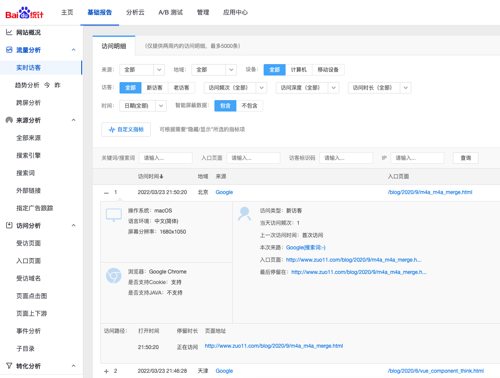
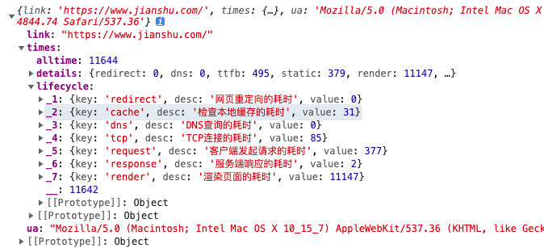

# zuo-statistics

web ua/pa statistics

从 0 到 1 写一个类似百度统计的轮子

- 前端上报用原生 js
- 后台管理系统用 Vue3 + TS + `@vue/cli`
- 服务端 Nest.js + mysql



## 使用场景

在页面中引入一个 js，初始化即可完成上报

下面是百度统计的引用示例

```html
<script>
var _hmt = _hmt || [];
(function() {
  var hm = document.createElement("script");
  hm.src = "https://hm.baidu.com/hm.js?183281668cc3440449274d1f93c04de6";
  var s = document.getElementsByTagName("script")[0]; 
  s.parentNode.insertBefore(hm, s);
})();
</script>

// zuo11.com 统计代码
<script>
var _hmt = _hmt || [];
(function() {
  var hm = document.createElement("script");
  hm.src = "http://zuo11.com:3000/zs.js?183281668cc3440449274d1f93c04de6";
  var s = document.getElementsByTagName("script")[0]; 
  s.parentNode.insertBefore(hm, s);
})();
</script>

// fe.zuo11.com 统计代码
<script>
var _hmt = _hmt || [];
(function() {
  var hm = document.createElement("script");
  hm.src = "http://zuo11.com:3000/zs.js?283281668cc3440449274d1f93c04de6";
  var s = document.getElementsByTagName("script")[0]; 
  s.parentNode.insertBefore(hm, s);
})();
</script>
```

分析百度统计的上报流程，script 标签动态加载 hm.js 文件(参见 test/hm.js)，然后这个 js 会通过创建 1x1 的 gif 图片来发送 get 请求上报信息？

为什么上报埋点用 gif？参考：[为什么通常在发送数据埋点请求的时候使用的是 1x1 像素的透明 gif 图片？](https://github.com/Advanced-Frontend/Daily-Interview-Question/issues/87)

- 能够完成整个 HTTP 请求+响应（尽管不需要响应内容）
- 触发 GET 请求之后不需要获取和处理数据、服务器也不需要发送数据
- 跨域友好
- 执行过程无阻塞
- 相比 XMLHttpRequest 对象发送 GET 请求，性能上更好
- GIF的最低合法体积最小（最小的BMP文件需要74个字节，PNG需要67个字节，而合法的GIF，只需要43个字节）

结合 JS高级程序设计第 4 版中的 [Beacon API](http://fe.zuo11.com/js/ad3/js-ad3-24.html#beacon-api) 在页面 unload 时候上报信息

```js
navigator.sendBeacon('/user', `{ page: '/xxx', duration: '12s' }`)
```

## 服务端

### 服务端 nest.js

[nest.js](https://docs.nestjs.com/) 技术调研，[Nest.js 和 koa 有什么不一样？](https://www.zhihu.com/question/323525252)

- koa 是渐进式的，很多都依赖其他库，需要手动引入
- nest.js 支持 ts，可以很好的发挥装饰器的优势，功能集中，很多功能帮你集成好了，脚手架创建时自带 eslint,prettier,jest,git等（需要更多的学习成本）

```js
sudo npm i -g @nestjs/cli 
nest new statistics-server
```

由于我们这里同一仓库下有两个项目前端、后端，所以需要进入 statistics-server 目录 rm -rf .git 删掉脚手架生成的 git

### 静态服务(统计 js、上报 gif)

nest 利用 express 开启静态服务，将上报的 js 文件，gif 图放到 public 目录

- 1.页面引入统计代码
- 2.加载 js 文件
  - 2.1 js 文件监听 load 事件，收集数据并上报(通过 gif params 传参)
  - 2.2 前端上报数据分三种: UA（用户信息，减少服务器压力，前端处理，参考: [ua笔记](http://fe.zuo11.com/js/ad3/js-ad3-13.html)）、性能（[performance.timing](http://www.zuo11.com/blog/2020/12/performance-timing.html)、[js高程4相关](http://fe.zuo11.com/js/ad3/js-ad3-20.html#%E8%AE%A1%E6%97%B6-api-performace%E6%80%A7%E8%83%BD))、错误收集(参考：[错误处理](http://fe.zuo11.com/js/ad3/js-ad3-21.html))
- 3.服务端 nest.js 获取参数，并持久化数据，这里服务端也需要收集部分信息：IP、IP归属地（可用于地域统计，用于屏蔽恶意 IP 爬虫、骚扰）、宽带类型、origin/host 同源检测、页面跳转还是直接访问：Referer、UA,PV,页面怎么计算

  

> performance.timing 即将废弃，需要替换为 PerformanceNavigationTiming，当前处于实验性阶段，兼容性还可以，后面抽空研究下

### mysql

安装 mysql，root/abc123456! 安装完成后，测试

mysql -uroot -p

需要设置环境变量，在系统偏好这种里面找到最下面的 mysql 然后点击去，configuration 中可以看到 mysql 安装的路径

mysql 命令路径为 /usr/local/mysql/bin/mysql，设置环境变量，这样在任何目录下就都可以访问 mysql 了， 参考：[mysql基本操作](http://www.zuo11.com/blog/2016/10/db_mysql_basecmd.html)

```sql
create database zuo_statistics;
use zuo_statistics;
-- - id 主键

-- - ip
-- - region 地域
-- - 宽带运营商
-- - count 该 ip 的第几次访问
-- - referer 来源，判断是否是直接访问

-- - perf_load
-- _ perf_dom_content_loaded
-- - perf_ttfb Time To First Byte
-- - performance.timing 完整信息
-- - perf.calcData 计算后的性能数据

-- - ua   navigator.userAgent
-- - uaInfo 转换后的 ua 信息
-- - isMobile 是否是移动端
-- - platform 使用 navigator.platform
-- - language 语言 navigator.language
-- - hardwareConcurrency cpu核心/线程
-- - deviceMemory 内存
-- - cookie 是否开启 cookie, navigator.cookieEnabled
-- - network 网络情况

-- - url 完整链接  location.href
-- - pathname 路径（用于计算访问量）不会包含 search 查询字段 

-- - screen 分辨率
-- - screen_info 分辨率、dpr设备像素比、颜色深度

-- - 访问时间
-- - extra1
-- - extra2
-- - extra3

create table base (
  id int auto_increment primary key,
  ip varchar(20) default '',
  region varchar(50) default '',
  networkServe varchar(50) default '',
  count int default 1,
  referer varchar(256) default '',
  perf_load varchar(20) default '', 
  perf_dom_content_loaded varchar(20) default '',
  perf_ttfb varchar(20) default '',
  performance_timing text,
  perf_calcData varchar(200) default '',
  ua varchar(200) default '',
  uaInfo varchar(300) default '',
  isMobile boolean default 0,
  platform varchar(20) default '',
  lang varchar(20) default '',
  hardware_concurrency int default 0,
  deviceMemory int default 0,
  cookieEnabled boolean default 0,
  network varchar(10) default '',
  href varchar(300) default '',
  pathname varchar(100) default '',
  screen varchar(20) default '',
  screen_info varchar(50) default '',
  time timestamp default current_timestamp,
  extra1 varchar(100) default "",
  extra2 varchar(100) default "",
  extra3 varchar(100) default "",
  siteId varchar(64) default ""
);
show tables;
-- insert into base (href,lang) values ('/home', 'ch');
select * from tb_access;


alter table base add siteId varchar(64) default ""; // 添加列
alter table base add uuid varchar(64) default ""; // 添加列
alter table base add uuidUaIp varchar(64) default ""; 

```

## 后台管理系统 vue3+ts

脚手架 <https://cli.vuejs.org/guide/installation.html>

```js
npm install -g @vue/cli
vue create statistics-fe
```

## 快捷命令

select id,ip,region,ua,screen,time from base;
select id,ip,region,screen,time,referer from base;
select id,ip,region,screen,time,referer from base where DATE_FORMAT(time, '%Y%m%d') = '20220327';

## 问题记录

### 当前统计数据比百度统计数据少很多

查看 pm2 log --lines 1000

#### 排查错误记录，针对性修复

1、sqlMessage: 'Data too long for column \'networkServe\' at row 1',
香港 城市电讯有限公司 / 北京市海淀区 联通ADSL
| region                  | varchar(50)  | YES  |     |                   |                   |
| networkServe            | varchar(10)  | YES  |     |                   |                   |
解决方法，networkServe 字段改为 50，mysql 命令如下

```sql
alter table base change networkServe networkServe varchar(50) default ''; 
```

2、'Data too long for column \'uaInfo\' at row 1'
'{"ua":"","browser":{"name":"Edge","version":"99.0.1150.52","major":"99"},"engine":{"name":"Blink","version":"99.0.4844.74"},"os":{"name":"Windows","version":"10"},"device":{},"cpu":{"architecture":"amd64"}}'.length
206 长度

```sql
alter table base change uaInfo uaInfo varchar(300) default ''; 
```

3、来源信息都是 referer: 'http://www.zuo11.com/'

- 同样的一条记录百度统计里面有来源信息，包含搜索关键字，但我们这里来源确是 zuo11.com
- 百度统计在前端获取的，而不是后端，后端请求头获取不到。
- document.referrer
- 新窗口打开时怎么保持 chorme F12 面板一直开着 <https://www.jianshu.com/p/fd5ff7a19346>

4、 sqlMessage: 'Data too long for column \'screen_info\' at row 1',
'{"size":"2066x1162","dpr":1.2395833730697632,"colorDepth":24}'
限制 50 => 100
alter table base change screen_info screen_info varchar(100) default '';

5、ua/referer 都加到 500
alter table base change referer referer varchar(500) default '';
alter table base change ua ua varchar(500) default '';

#### 错误 log 统一记录到一个位置

使用 log4js

### uv 怎么生产访客标识

访客标识码是百度统计根据访客的访问设备、系统环境、cookie等参数生成的一个用于识别唯一访客的标记。屏蔽一个访客标识码，实际是屏蔽其对应的一个或者多个商盾屏蔽码，因统计口径略有差异，极少数情况下，一个访客标识码对应的商盾屏蔽码发生变化，可能导致该访客标识码屏蔽效果不完全。

一个用户基本不会变的属性、可以唯一标识用户身份

- 电脑系统 win 10 / mac
- 是否是移动端
- CPU 核心/线程
- IP
- Cookie

标记新老用户，用户唯一标识优缺点分析：（针对百度统计类，非登录游客计算 uid）

- 根据 express-session 生成的 session id 来标识用户
  - 缺点: 前端用户清除 cookie 后, session id 会变
- 根据 IP 标识
  - 缺点: 网络供应商不稳定，换了网络环境 ip 会变
- 根据 ua 来标识
  - 缺点：ua 包含浏览器版本信息、可设置，升级浏览器版本后 ua 值也会变
- ua、cpu、屏幕分辨率标记用户有一定重复的概率

理论上，怎么计算都会有缺点，这里我们尽量找到一种合理的方案，
方式1：ip + ua
方式2：sessionID
